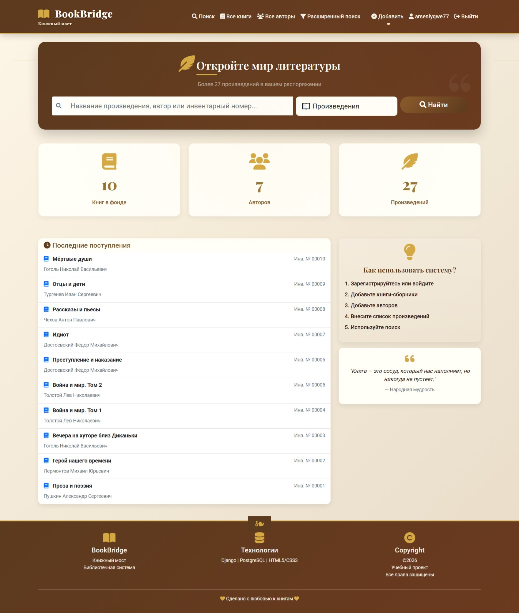
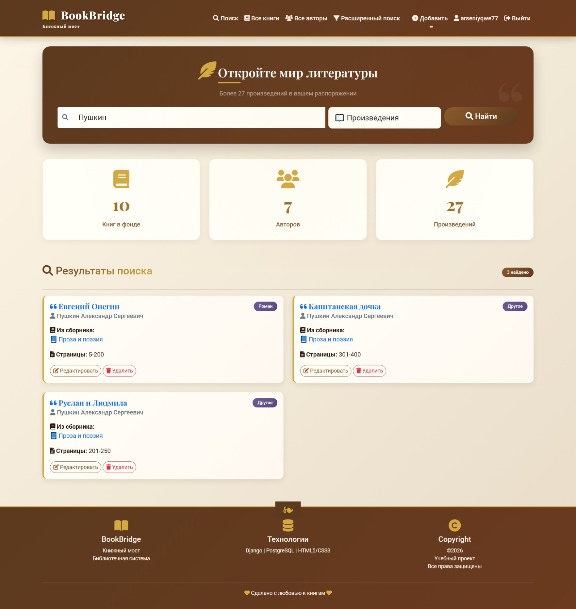
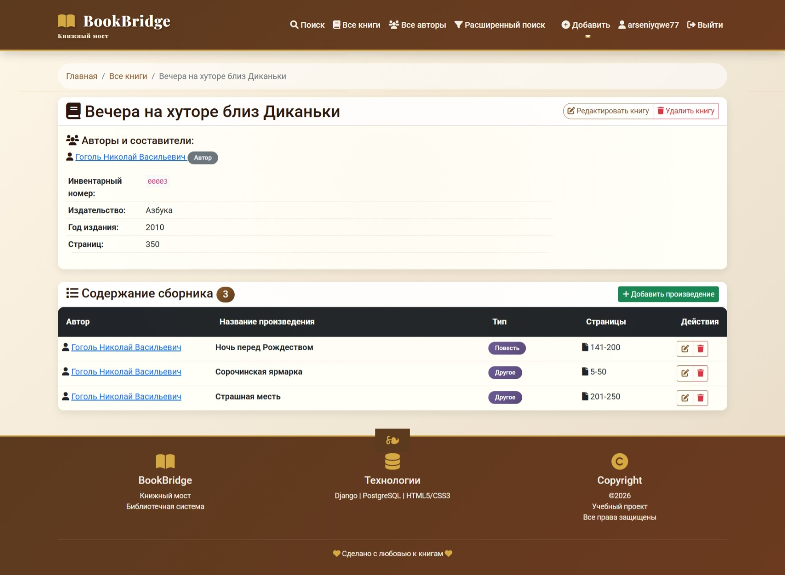
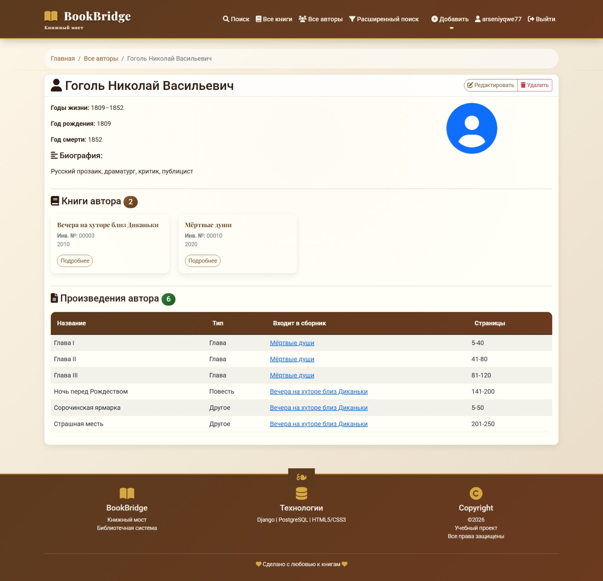
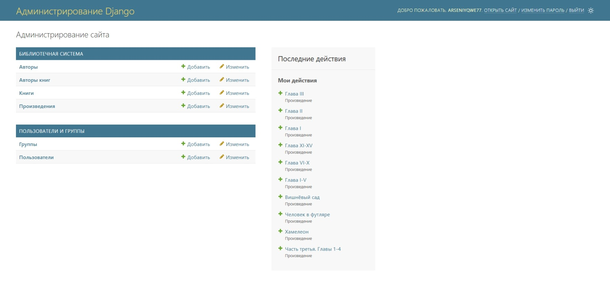

```markdown
# 📚 BookBridge — Книжный мост

**BookBridge** — это веб-приложение для каталогизации и поиска книг, авторов и произведений. Проект создан как портфолио для Junior Python/Django-разработчика.

🔗 **Сайт:** [https://arseniyqwe777-my-django-project-d6f4.twc1.net](https://arseniyqwe777-my-django-project-d6f4.twc1.net)

---

## 📖 О проекте

Библиотечная система, которая позволяет:
- Добавлять, редактировать и удалять **книги**, **авторов** и **произведения**
- Искать книги и авторов по названию и инвентарному номеру
- Использовать **расширенный поиск** с фильтрацией по типу произведения и году публикации
- Управлять контентом через удобную **админ-панель Django**

Проект создан в рамках обучения по специальности **09.02.07 «Информационные системы и программирование»** и демонстрирует навыки веб-разработки на Django.

---

## 🛠️ Технологии

| Компонент | Технология |
|-----------|------------|
| **Язык** | Python 3.11 |
| **Фреймворк** | Django 5.1 |
| **База данных** | PostgreSQL (в продакшене), SQLite (для разработки) |
| **Сервер** | Gunicorn |
| **Статика** | Whitenoise |
| **Контейнеризация** | Docker |
| **Вёрстка** | HTML5, CSS3, Bootstrap 5 |
| **Деплой** | Timeweb Cloud |
| **Версионирование** | Git, GitHub |

---

## 🚀 Функциональные возможности

- 🔐 **Авторизация:** регистрация, вход, выход
- 📚 **CRUD-операции** для книг, авторов, произведений
- 🔍 **Поиск** по названию, автору, инвентарному номеру
- 🧩 **Расширенный поиск** с фильтрацией по типу и году
- 🖼️ **Обложки книг** (загрузка изображений)
- 👑 **Админ-панель** для управления контентом
- 📊 **Статистика** на главной странице
- ⭐ **Избранное** и рейтинг книг (дополнительный функционал)
- 📤 **Экспорт данных** в CSV

---

## 📸 Скриншоты

### Главная страница


### Поиск


### Страница книги


### Страница автора


### Админ-панель


---

## 🏗️ Архитектура проекта

```
nn_project/
├── app/                    # Основное приложение
│   ├── migrations/         # Миграции базы данных
│   ├── static/             # CSS, JS, изображения
│   ├── templates/          # HTML-шаблоны
│   ├── models.py           # Модели данных
│   ├── views.py            # Контроллеры
│   ├── urls.py             # Маршруты
│   ├── forms.py            # Формы
│   ├── admin.py            # Настройки админки
│   └── utils.py            # Вспомогательные функции
├── nn_project/             # Настройки проекта
│   ├── settings.py         # Конфигурация Django
│   ├── urls.py             # Главные маршруты
│   └── wsgi.py             # WSGI-точка входа
├── screenshots/            # Скриншоты для README
├── staticfiles/            # Собранная статика
├── media/                  # Загруженные пользователем файлы
├── Dockerfile              # Инструкция для сборки Docker-образа
├── requirements.txt        # Зависимости Python
└── manage.py               # Управляющий скрипт Django
```

---

## 🔧 Установка и запуск

### Локальная разработка

1. **Клонируй репозиторий:**
   ```bash
   git clone https://github.com/arseniyqwe777/my-django-project.git
   cd my-django-project
   ```

2. **Создай и активируй виртуальное окружение:**
   ```bash
   python3 -m venv .venv
   source .venv/bin/activate  # для Windows: .venv\Scripts\activate
   ```

3. **Установи зависимости:**
   ```bash
   pip install -r requirements.txt
   ```

4. **Примени миграции:**
   ```bash
   python manage.py migrate
   ```

5. **Создай суперпользователя:**
   ```bash
   python manage.py createsuperuser
   ```

6. **Собери статику:**
   ```bash
   python manage.py collectstatic --noinput
   ```

7. **Запусти сервер:**
   ```bash
   python manage.py runserver
   ```

8. **Открой сайт в браузере:** [http://127.0.0.1:8000](http://127.0.0.1:8000)

---

### Запуск через Docker

```bash
docker build -t bookbridge .
docker run -p 8000:8000 bookbridge
```

---

## 🔗 API и экспорт

- **CSV-экспорт книг:** `/export/books/`
- **CSV-экспорт авторов:** `/export/authors/`
- **CSV-экспорт произведений:** `/export/works/`

---

## 🧪 Технические детали

### Модели данных

| Модель | Описание |
|--------|----------|
| `Author` | Автор: имя, фамилия, годы жизни, биография |
| `Book` | Книга: название, инвентарный номер, издательство, год, страницы, обложка |
| `BookAuthor` | Связь книга-автор с ролью (автор, составитель, редактор) |
| `Work` | Произведение: название, автор, тип, страницы в книге, год публикации |
| `UserBook` | Избранное пользователя: книга, рейтинг, рецензия |

### Безопасность

- **CSRF-защита** включена
- **HTTPS/SSL** настроен (Let's Encrypt)
- **CSRF_COOKIE_SECURE** и **SESSION_COOKIE_SECURE** включены

---

## 📈 Планы по развитию

- [ ] REST API на Django REST Framework
- [ ] Автотесты (unittest/pytest)
- [ ] Кэширование страниц (Redis)
- [ ] Telegram-бот для поиска книг
- [ ] Возможность добавлять книги в избранное без регистрации

---

## 📝 Лицензия

Это учебный проект. Все права защищены. Создано для портфолио.

---

## 👤 Автор

**Арсений**  
- **Специальность:** 09.02.07 Информационные системы и программирование  
- **Сайт:** [https://arseniyqwe777-my-django-project-d6f4.twc1.net](https://arseniyqwe777-my-django-project-d6f4.twc1.net)  
- **GitHub:** [arseniyqwe777](https://github.com/arseniyqwe777)  

---

⭐ Если этот проект помог вам, поставьте звёздочку на GitHub! ⭐
```